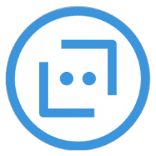

# CURSO DE MICROSOFT BOT FRAMEWORK
👨‍⚖️O MICROSOFT BOT FRAMEWORK É UMA PLATAFORMA DA MICROSOFT QUE PERMITE O DESENVOLVIMENTO DE CHATBOTS PARA INTERAÇÃO COM USUÁRIOS EM DIVERSOS CANAIS, COMO WEBSITES, APLICATIVOS DE MENSAGENS E ASSISTENTES VIRTUAIS. ESSA FERRAMENTA FACILITA A CRIAÇÃO DE CHATBOTS INTELIGENTES E PERSONALIZADOS PARA DIFERENTES FINALIDADES.

  

## CONCEITO:
O Microsoft Bot Framework é uma plataforma de desenvolvimento que permite criar bots inteligentes para interagir com usuários através de diferentes canais de comunicação, como o Skype, o Microsoft Teams, o Telegram, entre outros.

## SUA HISTÓRIA:
O Microsoft Bot Framework foi lançado pela Microsoft em março de 2016. Ele foi desenvolvido para oferecer uma plataforma robusta e escalável para a criação de bots inteligentes, permitindo interações naturais com usuários através de várias plataformas e serviços. A iniciativa visava facilitar a integração de recursos avançados de inteligência artificial e análise de linguagem natural (NLP) em aplicativos corporativos e de consumo, alavancando as capacidades dos serviços cognitivos da Microsoft, como o Azure Cognitive Services.

## CARACTERÍSTICAS:
### POSITIVAS:
- Facilita o desenvolvimento de bots multiplataforma.
- Integração com serviços cognitivos para adicionar capacidades de IA aos bots.
- Suporte robusto e documentação extensa da Microsoft.
- Amplamente utilizado em empresas devido à integração nativa com o ecossistema Microsoft.

### NEGATIVAS:
- Curva de aprendizado inicial para quem não está familiarizado com o ambiente de desenvolvimento Microsoft.
- Algumas limitações em personalização avançada podem surgir ao integrar com sistemas externos não-Microsoft.

## SUBSIDIOS:
- [CURSO CRIADO PELA "GLAUCIA LEMOS"](https://youtube.com/playlist?list=PLb2HQ45KP0Ws3dVMoxliVX5ici53RmiNV&si=U_lni9RjCeC3gNr3)
- [CURSO FEITO PELO VILHALVA](https://github.com/VILHALVA)
- [VEJA A DOCUMENTAÇÃO DO MICROSOFT BOT FRAMEWORK](https://learn.microsoft.com/pt-br/azure/bot-service/index-bf-sdk?view=azure-bot-service-4.0)
- [VEJA A DOCUMENTAÇÃO DO BOTBUILDER NO NPM](https://www.npmjs.com/package/botbuilder)
- [VEJA A DOCUMENTAÇÃO DO BOTBUILDER NA WEB](https://learn.microsoft.com/pt-br/javascript/api/botbuilder/?view=botbuilder-ts-latest)
- [VEJA A DOCUMENTAÇÃO DO RESTIFY NO GITHUB](https://github.com/restify/node-restify)
- [VEJA A DOCUMENTAÇÃO DO RESTIFY NA WEB](http://restify.com/)
- [LINGUAGEM DE PROGRAMAÇÃO](https://github.com/VILHALVA/CURSO-DE-JAVASCRIPT)
- [TECNOLOGIA](https://github.com/VILHALVA/CURSO-DE-NODEJS)
- [VEJA O MANUAL](./MANUAL.md)
- [VEJA TODOS OS PROJETOS](https://github.com/VILHALVA?tab=repositories&q=+topic:MICROSOFT-BOT-FRAMEWORK)

